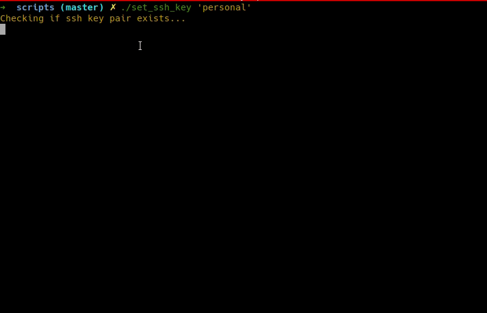

# Personal scripts

A collection of scripts to make my life easier. WIP.

## SSH Keys

Make a given ssh key the default (id_rsa and id_rsa.pub).

**Note: Original id_rsa keys will be overwritten, so backup them xD**



### Prerequisites

The pair of keys (private and public) must exist at ~/.ssh in the format:

```
id_rsa_{KEY}, id_rsa_{KEY}.pub
```

### How to use

Assuming 2 ssh keys, one personal and one for work purposes, in the format:

* id_rsa_personal
* id_rsa_personal.pub
* id_rsa_work
* id_rsa_work.pub

If you want to use your personal key as default, just call:

```
./set_ssh_key 'personal'
```